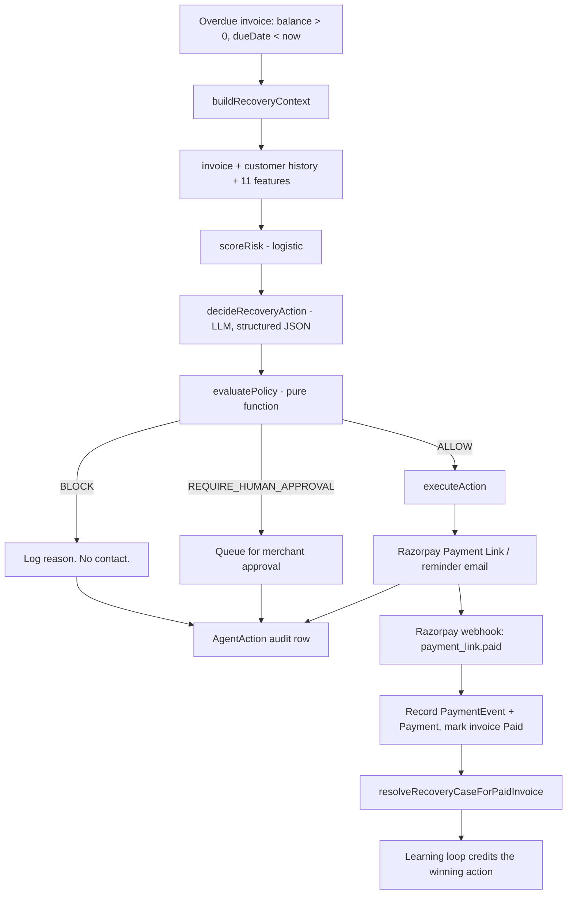

# 24CE064 — Project Proposal

**InvoNotify AI — An Autonomous Revenue Recovery Agent for Indian B2B Invoicing**

> Submitted as an SGP (Software Group Project) deliverable, and simultaneously
> entered into the **Razorpay AI Buildathon — Track 03: AI Revenue Recovery**.

---

## 0. Cover

| Field | Value |
|---|---|
| Student ID | **24CE064** |
| Name | Heet Mehta |
| Department | Computer Engineering (CE) |
| Institute | CSPIT — CHARUSAT University |
| Project title | InvoNotify AI — Autonomous Revenue Recovery Agent |
| Repository | https://github.com/HEETMEHTA18/InvoNotify (public) |
| Buildathon track | **03 — AI Revenue Recovery** |
| Payment rails | Razorpay (**Test Mode**) + Stripe |
| Applications close | **5 September** |
| Status | Working system — 76 commits, ~6,900 LOC in the AI subsystem alone |

**To confirm before submitting the Google Form:** graduation year, current
semester, in-person-from-September (yes/no), 6-vs-12-month preference, resume
file, 5-minute pitch video URL (unlisted YouTube is acceptable), and the
production deployment URL.

---

## 1. Executive Summary

The SGP began as an **Invoice Management System (IMS)** — create invoices,
track payments, fire reminders on a cron. That solves *bookkeeping*. It does not
solve the thing that actually costs an Indian SMB money: **invoices that quietly
never get paid.**

This proposal covers the second half of the project — turning a passive reminder
scheduler into an **autonomous, bounded, auditable revenue recovery agent** that:

1. **Predicts** which overdue invoices will not be paid (logistic ML model, `payment-risk-v1`)
2. **Decides** a differentiated recovery strategy per invoice (LLM constrained to 6 enum actions)
3. **Gates** every decision through a deterministic policy engine before any money action fires
4. **Executes** through **Razorpay Payment Links** with fallback chains
5. **Closes the loop** via signature-verified, idempotent Razorpay webhooks
6. **Learns** which strategies actually convert, from its own audit trail

Positioning line for the pitch video:

> *"An autonomous revenue-recovery agent that predicts which invoices won't pay,
> chooses differentiated strategies, executes through gated Razorpay actions,
> knows when to stop — and shows its work."*

---

# PART A — The SGP Project

## 2. Origin: from IMS to InvoNotify

### 2.1 The original SRS scope

The approved SRS (`Documentation/SRS.md`) specified a web-based Invoice
Management System with:

- Secure authentication (NextAuth), financial dashboard, multi-template invoices
- GST-aware tax calculation (GST / CGST / SGST / IGST)
- Payment status tracking (Paid / Unpaid / Overdue)
- Automated email + SMS reminders on configurable offsets (7 / 3 / 1 day before due)
- Recurring overdue alerts via **Vercel Cron**, protected by `CRON_SECRET`

Notably, the SRS's own *Appendix C: Issues List* already flagged the next step:

> *"Future support for direct one-click payment links (Stripe/Razorpay)."*

This proposal delivers that item — and then goes considerably past it.

### 2.2 What the base platform does today

| Capability | Implementation |
|---|---|
| Invoice CRUD + PDF generation + mail delivery | `app/api/invoices/**`, jsPDF |
| Auth (Google OAuth + credentials) | NextAuth v5, `lib/auth.ts` |
| Reminder automation with idempotent logs | `/api/reminders/auto`, `InvoiceReminderLog` |
| Multi-channel delivery | Email (SMTP), SMS, voice (Sarvam AI), Telegram mirror |
| Dashboard analytics | Recharts — KPIs, revenue trend, risk insights |
| Bulk import | YAML / Tally-oriented flows |
| Owner scoping | Every query filtered by `ownerUserId` |

### 2.3 Tech stack

| Layer | Choice |
|---|---|
| Framework | Next.js (App Router) + TypeScript |
| Backend | Next.js route handlers — `app/api/**/route.ts` |
| ORM / DB | Prisma → PostgreSQL (Neon) |
| Auth | NextAuth v5 |
| UI | Tailwind CSS, Radix UI, Recharts, Motion |
| Payments | **Razorpay Payment Links** (Test Mode), Stripe Checkout |
| ML training | Python 3.12 + scikit-learn (`ai/ml/training/train.py`) |
| ML inference | Pure TypeScript (`lib/ai/ml/risk-model.ts`) — no Python at runtime |
| Validation | Zod (including boot-time env validation) |
| Hosting / scheduling | Vercel (region `sin1`) + Vercel Cron + GitHub Actions backup |

**Design note worth defending in the panel:** training is Python, inference is
TypeScript. The model ships as a 
JSON weight vector (`lib/ai/ml/model-weights.json`) that the Next.js runtime
reads directly. No Python process, no model server, no cold-start penalty in
production. The cost of that choice is **train/serve skew risk** — addressed in
§9.

### 2.4 Data model (recovery-relevant tables)

```
Invoice ──1:N── Payment
   │  └── razorpayPaymentLinkId / razorpayPaymentLinkUrl / razorpayPaymentId
   ├──1:N── InvoiceReminderLog
   ├──1:N── PaymentEvent          (every Razorpay money event)
   └──1:1── RecoveryCase
                 └──1:N── AgentAction ──N:1── AgentRun
Customer
   ├── cibilScore
   ├── communicationOptOut         (compliance flag)
   └── isVipExempt
WebhookEvent   (eventId UNIQUE — idempotency for Stripe + Razorpay)
```

Migrations that introduced the recovery layer:

| Migration | Purpose |
|---|---|
| `20260403183000_add_customer_cibil_score` | Credit signal as an ML feature |
| `20260820000000_add_ai_recovery_models` | `RecoveryCase`, `AgentRun`, `AgentAction` |
| `20260820120000_add_razorpay_payment_events` | `PaymentEvent` + Razorpay columns |
| `20260823000000_add_customer_communication_optout` | Opt-out compliance flag |
| `20260823130000_repair_owner_scoping_drift` | Multi-tenant isolation repair |

---

# PART B — The Razorpay AI Buildathon

## 3. Program brief

**Razorpay AI Buildathon — "Build. Show. Get hired."**
A students-only program to discover and hire Razorpay's next generation of **AI
Builder Interns**.

- **No resume screening. No long application. No aptitude test. No group discussion.**
- Four steps: **pick a track → build something real → show your work → get called in.**
- "Show your work" = a **public repo**, a **5-minute pitch video**, and the **architecture**.
- Shortlisted builders go **straight to a panel**.

> *"Your code speaks louder than your resume."*

### 3.1 The five tracks

| # | Track | Core ask | The bar |
|---|---|---|---|
| 01 | **AI Growth & Agentic Commerce** | Grow merchant revenue, or make a merchant transactable by an AI buyer end-to-end (test-mode APIs) | Every money action explainable, bounded, gated. Show the audit trail + one failure handled gracefully |
| 02 | **AI Risk Manager** | Detector / verifier / auto-responder for one class of loss (fraud, returns, chargebacks) | Honest metrics including false-positive cost. **Defense-only** — anything offense-capable is disqualified |
| 03 | **AI Revenue Recovery** ⭐ | Detect revenue at risk, diagnose it, choose the right intervention, execute a **bounded** recovery workflow | **Measured money recovered across a batch**, compliant escalation, **stopping rules**, and an **audit trail** |
| 04 | **AI Finance Controller** | Close one finance-ops loop over a 50+ record batch; report match rate + unresolved exceptions | Throughput + measured accuracy + an honest exception list. One cherry-picked match proves nothing |
| 05 | **Open Track** | Build what you believe should exist | Open ≠ easier. Same bar for execution, reliability, and depth |

### 3.2 Track 03 in full (the one selected)

**"Find revenue that's slipping away and win it back."**

*Why now (Razorpay's framing):* revenue loss rarely happens in one clean step. A
payment degrades, a checkout gets abandoned, a subscription fails, or an invoice
goes overdue. AI can now close the loop — from detecting the problem, to
diagnosing it, to choosing the right intervention, to recovering the money.

*Example directions given:* payment degradation → root cause → recovery action ·
checkout drop-off recovery · failed-subscription recovery · **B2B receivables
chaser** · mandate retry sequencer · Hinglish voice recovery · promise-to-pay
tracker.

### 3.3 The offer

| | |
|---|---|
| Stipend | **₹75,000 / month** |
| Duration | **6 or 12 months** — builder's choice |
| Mode | **In-person, Bangalore, from September** |
| Process | Shortlisted → straight to panel. No aptitude test, no GD |

### 3.4 What the form asks for (12 items) — and our answers

| # | Form field | Answer |
|---|---|---|
| 1 | Full name | Heet Mehta |
| 2 | College | CSPIT — CHARUSAT University |
| 3 | Graduation year | *TBC* |
| 4 | In-person from September (y/n) | *TBC* |
| 5 | 6 or 12 months | *TBC* |
| 6 | Resume file | *attach* |
| 7 | **Your track** | **03 — AI Revenue Recovery** |
| 8 | **Project name** | **InvoNotify AI — Autonomous Revenue Recovery Agent** |
| 9 | **What it solves** | Indian SMBs lose real margin to overdue B2B receivables. A flat reminder cron treats every debtor identically. This agent scores default risk per invoice, picks a *differentiated* intervention, gates money actions through a deterministic policy layer, executes via Razorpay Payment Links, knows when to stop chasing, and logs every decision for audit. |
| 10 | GitHub repo (public) | https://github.com/HEETMEHTA18/InvoNotify |
| 11 | 5-min pitch video | *record — script at `docs/DEMO_SCRIPT.md`* |
| 12 | **What broke, and how you got out** | See **§9** — this is the answer they read first. |

### 3.5 How Razorpay judges

| Criterion | Where this project answers it |
|---|---|
| **Problem taste** — did you pick something that actually matters | Receivables leakage is a real, unglamorous, measurable P&L line for Indian SMBs (§4.1) |
| **Build quality** — does it run, is it structured, would you trust it | current automated test suite, typed end-to-end, CI-gated, health + metrics endpoints, idempotent webhooks (§8) |
| **AI judgment** — the right tool in the right place, *and where you chose not to use one* | ML for ranking; LLM for strategy selection only; **deterministic code for anything touching money** (§6.3) |
| **Failure recovery** — what broke, and what you did about it | Three real defects found and fixed, two of them silent-in-production class (§9) |

---

# PART C — Track fit and the Razorpay problem

## 4. Why Track 03, and how Razorpay is used

### 4.1 Why this track

The SGP already owned the **detection** half of the problem: it knows which
invoices exist, what's overdue, who the customer is, and how they've paid in the
past. That is precisely the data substrate Track 03 asks for. What was missing
was **diagnosis, intervention, and bounded execution** — the agentic half.

Of Razorpay's listed example directions, this project is a **B2B receivables
chaser** with a **promise-to-pay/attempt tracker** underneath it. It is a
deliberate choice to go deep on one direction rather than sample four shallowly.

Track 03's bar is also the strictest to fake, which is why it was chosen:
"measured money recovered across a batch" cannot be demoed with one cherry-picked
invoice.

### 4.2 The recovery problem, restated concretely

An invoice goes overdue. A naive system emails the same reminder to everybody,
forever. That is wrong in four separate ways:

1. **No differentiation** — a reliable customer who is 2 days late and a ghosted new
   account with a ₹4L balance get identical treatment.
2. **No friction removal** — a reminder tells someone they owe money; it doesn't let
   them pay in one tap.
3. **No stopping rule** — the reminder cron becomes a spam cannon, and compliance
   risk compounds.
4. **No explanation** — when the merchant asks "why did we chase this client
   four times?", there is no answer.

### 4.3 Where Razorpay sits in the architecture

Razorpay is not a checkout bolted on at the end. It is the **execution and
feedback rail** of the agent loop:

| Direction | Razorpay surface | Role in the loop |
|---|---|---|
| **Outbound (execute)** | Payment Links API — create / fetch / resend / cancel | The agent's money action. `CREATE_PAYMENT_LINK` removes payment friction instead of merely nagging |
| **Inbound (learn)** | Webhooks — `payment_link.paid`, `payment_link.partially_paid`, `payment_link.expired`, `payment_link.cancelled`, `payment.captured`, `payment.failed` | Closes the loop: marks the invoice paid, **resolves the recovery case**, and writes the outcome label the ML model retrains on |
| **Autonomy triggers** | Same webhooks → internal event bus | `payment_link.expired` → re-engage · `payment.failed` → schedule retry · `invoice.paid` → close case |

Implementation deliberately uses **raw `fetch()` with Basic Auth** (`lib/razorpay.ts`)
rather than an SDK — one fewer dependency, and the HMAC/auth path stays fully
visible for audit. Amounts are converted to paise at the boundary. Keys are
server-only and never reach the client.

**Strictly Test Mode.** `RAZORPAY_KEY_ID` is an `rzp_test_*` key. No live money
moves anywhere in this submission.

---

# THE PROPOSED SYSTEM

## 5. Architecture

### 5.1 Four layers, one direction of trust

| Layer | File | Responsibility | Trusted with money? |
|---|---|---|---|
| **ML Risk Model** | `lib/ai/ml/risk-model.ts` | Logistic scorer → `riskScore`, `paymentProbability`, `expectedRecovery` | No — ranking only |
| **Decision Agent** | `lib/ai/agent/decision-agent.ts` | Picks 1 of 6 enum actions + channel + urgency + reason + confidence | No — **proposes** only |
| **Policy Engine** | `lib/ai/policy/engine.ts` | Deterministic gate → `ALLOW` / `BLOCK` / `REQUIRE_HUMAN_APPROVAL` | **Yes — sole authority** |
| **Action Engine** | `lib/ai/actions/engine.ts` | Executes via Razorpay / Stripe / email, with fallback chains | Only what policy allowed |

The critical property: **the LLM never calls a money API.** The path is
LLM → structured JSON decision → policy engine → action engine → Razorpay.

### 5.2 The sweep lifecycle



Orchestrated by `runRecoverySweep()` in `lib/ai/orchestrator.ts`, which supports
`{ userId, invoiceId, trigger: MANUAL | CRON | WEBHOOK, simulateFailures, now }`.
The injectable `now` is what makes back-dated and simulated sweeps deterministic.

### 5.3 The bounded action space

Exactly six actions exist (`lib/ai/agent/types.ts`). The LLM cannot invent a
seventh — and if a response contains one, policy rule 9 hard-blocks it
(**deny by default**).

```
SEND_REMINDER · CREATE_PAYMENT_LINK · RESEND_PAYMENT_LINK
SCHEDULE_FOLLOWUP · ESCALATE_TO_HUMAN · STOP
```

Action classes that policy reasons over:

```
CONTACT_ACTIONS      = SEND_REMINDER, CREATE_PAYMENT_LINK, RESEND_PAYMENT_LINK
MONEY_ACTIONS        = CREATE_PAYMENT_LINK, RESEND_PAYMENT_LINK
NOTIFICATION_ACTIONS = SEND_REMINDER, SCHEDULE_FOLLOWUP
```

`SCHEDULE_FOLLOWUP` is internal bookkeeping — it messages nobody, so it is not a
contact action. `ESCALATE_TO_HUMAN` contacts the **merchant**, not the customer,
which is why customer opt-out and cooldown correctly do not apply to it.

### 5.4 The policy engine — where the bar is actually met

`evaluatePolicy()` is a **pure function**: no DB, no IO, and no `new Date()` — the
clock arrives injected as `history.now`. That is what makes it exhaustively
unit-testable without a database (**28 tests**).

`POLICY_LIMITS` is the single exported source of truth — imported by the decision
agent, so no threshold is duplicated as a magic number anywhere:

| Limit | Value | Enforces |
|---|---|---|
| `autoMoneyLimit` | ₹50,000 | Payment link above this → human approval |
| `autoNotificationLimit` | ₹1,00,000 | Even a reminder above this → human approval |
| `maxContactAttempts` | 4 | Stop chasing; hand off to a human |
| `contactCooldownHours` | 48 | Minimum gap between two contacts on a case |
| `maxEscalationsPerDay` | 5 | One case can't flood the merchant's review queue |
| `costToRecoverFloor` | ₹200 | Below this, stop after one free attempt |

**Rule order — first match wins:**

| # | Condition | Verdict |
|---|---|---|
| 1 | Invoice `Paid` or balance ≤ 0 | **BLOCK** — nothing to recover |
| 2 | Invoice disputed | **BLOCK** — automation frozen |
| 3 | Action is `STOP` | **ALLOW** — a no-op is always safe |
| 4 | Action is `ESCALATE_TO_HUMAN` | **ALLOW** unless ≥ 5 escalations in 24h → **BLOCK** |
| 5 | `optedOut` and action ∈ `CONTACT_ACTIONS` | **BLOCK** — compliance |
| 6 | Stopping rules (contact actions, autonomous only) | **BLOCK** — attempts / cooldown / cost floor |
| 7 | Action ∈ `MONEY_ACTIONS` | Approval gate on balance & risk, else **ALLOW** |
| 8 | Action ∈ `NOTIFICATION_ACTIONS` | Approval gate on balance, else **ALLOW** |
| 9 | Anything unrecognized | **BLOCK** — deny by default |

Two deliberate asymmetries, both defensible in a panel:

- **Manual approval bypasses stopping rules.** Those are *autonomy* bounds — a
  human clicking approve has taken the decision themselves.
- **Manual approval does NOT bypass opt-out.** That is a *compliance* rule
  (checked at rule 5, before any economics), and no merchant click overrides it.

Crucially, **stopping-rule inputs are computed from the audit trail itself**
(`getContactHistory()` in `lib/ai/orchestrator.ts` reads `AgentAction` rows), so
the enforced bounds and the log physically cannot drift apart.

### 5.5 Graceful failure

| Failure | Handling |
|---|---|
| LLM unreachable / malformed JSON | Timeout + validation → **deterministic rules fallback**; the sweep never halts |
| Primary channel fails | Fallback chain: email → SMS (if phone) → `FAILED` with escalation note |
| Payment link creation fails | Falls back to sending a reminder email |
| Duplicate webhook delivery | `WebhookEvent.eventId` UNIQUE → `{ received: true, duplicate: true }` |
| Bad webhook signature | HMAC-SHA256 verify against `RAZORPAY_WEBHOOK_SECRET` → 400 |
| Duplicate payment | `transactionId` check inside a Prisma transaction |

Failure is not just handled, it is **exercised**: `pnpm qa:simulate-failures`
force-fails reminders to prove the fallback path, and `simulateFailures: true` is
a first-class sweep option.

### 5.6 Audit trail

Every decision writes one `AgentAction` row carrying: `riskScore` at decision
time, the **full LLM decision JSON**, human-readable `reason`, `urgency`,
`confidence`, `policyResult`, `policyReasons`, `approvalRequired` / `approvedBy` /
`approvedAt`, `status`, `executionStatus`, `failureReason`, `fallbackUsed`,
`provider`, `payload`, `completedAt`. Grouped under an `AgentRun`; joined to a
`RecoveryCase`; money events mirrored in `PaymentEvent`.

`components/recovery/RecoveryCaseDetail.tsx` renders this as a
**"Why did the AI do this?"** trail in the UI — per-feature risk contributions
included.

### 5.7 Learning loop

`lib/ai/learning.ts` derives which actions *actually* closed cases — purely from
the audit trail, **zero schema changes**. When a `RecoveryCase` reaches `PAID`,
the last `EXECUTED` action before resolution is credited as the win; open cases
with exhausted follow-ups count as losses, giving an honest denominator. Win
rates are only trusted past `MIN_SAMPLE_SIZE = 3`, and feed back into the
decision agent per risk segment.

### 5.8 Autonomy triggers

| Trigger | Mechanism |
|---|---|
| Scheduled | Vercel Cron → `/api/ai/recovery` every 6h (`0 */6 * * *`); reminders at `30 13 * * *` |
| Backup schedule | GitHub Actions `ai-recovery.yml`, same 6h cadence, `CRON_SECRET`-authenticated, fails loudly |
| Event-driven | Event bus registered at server start (`instrumentation.ts`) |
| Manual | Dashboard button → `POST /api/ai/recovery` |

### 5.9 API surface

| Method | Endpoint | Purpose |
|---|---|---|
| GET | `/api/ai/recovery` | List recovery cases + summary |
| POST | `/api/ai/recovery` | Trigger a recovery sweep |
| GET | `/api/ai/recovery/[id]` | Case detail + full audit trail |
| POST | `/api/ai/recovery/[id]/approve` | Merchant approves a gated action |
| GET | `/api/ai/metrics` | AI metrics dashboard |
| GET | `/api/ai/health` | DB / env / provider / model health |
| GET/POST | `/api/razorpay/payment-links` | List / create payment links |
| GET/POST/DELETE | `/api/razorpay/payment-links/[id]` | Fetch / resend / cancel |
| POST | `/api/webhooks/razorpay` | Signature-verified, idempotent webhook sink |
| GET | `/api/public/invoices/[id]` | Public pay page data (zero merchant internals) |

Rate limits: 5 sweeps/min and 10 approvals/min per user.

---

## 6. Meeting Track 03's bar, item by item

> *"Don't just identify the problem. Show measured money recovered across a batch,
> with compliant escalation, stopping rules, and an audit trail."*

| Bar item | Answer | Verify with |
|---|---|---|
| **Measured money recovered across a batch** | **+₹1,99,22,500** vs flat reminders on an identical **1000-invoice** portfolio — 92.9% vs 45.3% recovery, **−9.8 days** to pay. Explicitly labeled **SIMULATED** by the tool itself. | `pnpm ai:evaluate` → `docs/eval-metrics.json` |
| **Compliant escalation** | `Customer.communicationOptOut` blocks **all** customer-contact actions **including payment links**, and is **not** overridable by merchant approval. Escalation targets the merchant, capped at 5/24h per case. | `lib/ai/policy/engine.ts` rules 4–5 |
| **Stopping rules** | Four enforced bounds (4 attempts → hand off · 48h cooldown · ₹200 cost floor · 5 escalations/24h). In the eval run they forced **21 BLOCKED + 50 EXHAUSTED** and held contacts-per-recovery to **0.73**. | `POLICY_LIMITS` + rule 6 |
| **Audit trail** | Every run, decision, policy verdict, execution result and webhook persisted — and the stopping rules are *computed from* that trail, so bounds and log cannot diverge. | `AgentRun`, `AgentAction`, `RecoveryCase`, `WebhookEvent`, `PaymentEvent` |

### 6.1 Also satisfies Track 01's bar

Track 01 demands *"every money action explainable, bounded and gated; show the
audit trail and one failure handled gracefully."* All four hold here — the
explainability trail, the 6-action bounded space, the policy gate, and the
injected-failure fallback demo.

### 6.2 Where AI is deliberately *not* used

The judging rubric explicitly rewards knowing where **not** to use a model:

- **Money authority is deterministic code, never a model.** Policy is a pure function.
- **Risk scoring is logistic regression, not a neural net.** It is explainable per
  feature and sufficient; the retraining path on real outcomes is already wired.
- **Stopping rules are arithmetic over the audit trail**, not model judgement.
- **Idempotency is a UNIQUE constraint**, not a heuristic.

The LLM does exactly one job: pick a strategy from a closed set and explain why.

---

## 7. Measured results

> Two honesty labels apply, and the tools print them themselves. **(1)** the ML
> model is trained on a **synthetic** dataset — the metrics validate the
> *pipeline*, not real-world accuracy. **(2)** the recovery comparison is a
> **SIMULATED** outcome model, not live payment data.

### 7.1 ML risk model — `payment-risk-v1`

Predicts `riskScore = P(invoice is NOT paid)`. Synthetic dataset, 4000 samples
(seed 42), 3200 train / 800 held-out. **Base default rate 52.4%** — accuracy must
beat 0.524 to mean anything.

**Held-out test set (n = 800, threshold 0.5):**

| Metric | Value |
|---|---|
| Accuracy | 0.681 |
| Precision | 0.678 |
| Recall | **0.745** |
| F1 | 0.710 |
| ROC-AUC | 0.750 |
| Brier score | 0.202 (lower is better) |
| Polarity violations | **0** ✅ |

Recall is *deliberately* above precision: missing an invoice that then defaults
costs the merchant the whole balance; a false positive costs one polite email.
That is the false-positive-cost reasoning the rubric asks for.

Train vs test agree within ~0.01 on every metric — no overfitting. Calibration
holds within 2 points in 4 of 5 bins, which matters because the score is consumed
as a probability (`expectedRecovery = amountDue × paymentProbability`).

### 7.2 Strategy evaluation — does the agent recover more money?

`pnpm ai:evaluate` runs baseline and AI over the **same** 1000-invoice portfolio
with the same seed (`20260822`), so the delta is strategy, not luck.
Portfolio: **₹4,07,00,000** at risk across 5 customer archetypes × 200.

| | Baseline (flat reminder) | AI (risk→decision→policy) | Δ |
|---|---|---|---|
| Recovery rate | 45.3% | **92.9%** | **+47.6 pts** |
| ₹ recovered | ₹1,90,14,000 | **₹3,89,36,500** | **+₹1,99,22,500** |
| ₹-weighted share of at-risk | 46.7% | **95.7%** | +49.0 pts |
| Avg days to pay | 14.2 | **4.4** | **−9.8 days** |

**The asymmetry, stated before a judge has to ask:** the baseline is a single
flat reminder; the AI arm gets up to 5 bounded rounds. Part of the gap is
*persistence*, not intelligence. The per-archetype split is where **strategy
differentiation** shows up instead:

| Archetype | Recovered | Dominant decisions |
|---|---|---|
| Reliable | 192/200 (96%) | `SEND_REMINDER` 97 · `CREATE_PAYMENT_LINK` 61 |
| Average | 187/200 (94%) | `CREATE_PAYMENT_LINK` 76 · `SEND_REMINDER` 72 |
| Chronic-Late | 176/200 (88%) | `ESCALATE_TO_HUMAN` 176 · `EXHAUSTED` 24 |
| High-Value | 197/200 (99%) | `ESCALATE_TO_HUMAN` 197 · `EXHAUSTED` 3 |
| Ghost-New | 177/200 (89%) | `ESCALATE_TO_HUMAN` 177 · `EXHAUSTED` 23 |

Reliable and average payers get **automated contact**; chronic-late, ghosted and
high-value cases go to a **human** rather than being emailed harder. Same code
path, different outcome per segment.

**And the bounds bite:**

| Terminal state | Count | Meaning |
|---|---|---|
| `BLOCKED(...)` | **21** | Policy refused the proposed action |
| `EXHAUSTED` | **50** | Hit the 4-contact cap, handed off |
| `STOP` | 0 | Agent chose to stop on its own |
| `UNAPPROVED(...)` | 0 | Needed approval that never came |

**Contacts per recovered invoice: 0.73** — under one customer touch per rupee
recovered, because human-escalated cases contact zero customers. That single
number is the "compliant escalation" proof: recovery *without* escalating
contact volume.

### 7.3 Tests, CI and hygiene

```bash
pnpm ai:unit      # current suite — ML, policy, decision agent, rate limit
pnpm ai:eval      # ML metrics + polarity gate (CI-enforced on every push)
pnpm ai:evaluate  # baseline vs AI strategy comparison
pnpm ai:test      # end-to-end AI suite
pnpm test:e2e:recovery  # Playwright recovery journey
npx tsc --noEmit  # type check
```

**The current unit-test suite passes**. CI
(`.github/workflows/ci.yml`) runs lint → `tsc --noEmit` → build → `ai:unit` →
`ai:eval` on every push, with Python 3.12 pinned so exported weights are
reproducible.

Production hygiene: Zod env validation at boot (`lib/ai/config.ts`), per-user
rate limiting, structured JSON logs, `/api/ai/health` + `/api/ai/metrics`,
secrets server-only, security headers on `/api/ai/*` via `vercel.json`.

---

## 8. Honest limitations — what is *not* measured

Stated plainly, because a panel will ask and pretending otherwise is worse than
the gap itself:

1. **No live-payment recovery rate.** No production traffic exists. Every recovery
   figure here is simulated; Razorpay runs in **Test Mode**.
2. **No real-outcome model training.** Weights come from synthetic data. The
   retraining path is built (`pnpm ai:train --data <outcomes.jsonl>`) and
   `PaymentEvent` is *already capturing the labels it will need*.
3. **Baseline asymmetry** in the strategy eval (single-touch vs 5 bounded rounds) —
   disclosed above rather than buried.
4. **Contact-window enforcement not implemented.** Customer timezone and
   business-hour fields are stored but not enforced. It becomes mandatory the
   moment SMS or voice is added.
5. **Partial payments** are logged but not fully processed; **no refunds**, **no
   subscriptions/mandates** yet.
6. **Naming drift** — `package.json` says `incovice-management-system`, the README
   says "InvoiceFlow", docs say "InvoNotify". A judge cloning the repo will see
   all three. Fix before submission.

### 8.1 Deliberately not built, and why

- **SMS / WhatsApp / voice recovery channels** — payment links already email the
  customer; breadth ≠ depth, and email-only is what makes quiet hours unnecessary.
- **Multi-tenant org hierarchy** — single-merchant scope keeps the audit story clean.
- **Deep-learning risk model** — a logistic baseline is explainable and sufficient.

---

## 9. Form Q12 — "What broke, and how you got out"

*The answer Razorpay reads first. All three are real, and all three were the kind
of bug that demos perfectly and fails an audit.*

### 9.1 The opt-out leak (compliance)

Policy checked `communicationOptOut` only for **notification** actions. So
`CREATE_PAYMENT_LINK` sailed through the gate — and Razorpay then emailed the
opted-out customer anyway via `notify.email` in the payment-link payload. The
compliance guarantee was real for reminders and hollow for payment links.

Worse: the call site **hardcoded `optedOut: false`**, so the check was dead in
production regardless.

*Fix:* payment-link actions moved inside `CONTACT_ACTIONS`; the flag wired from
DB → `RecoveryContext` → orchestrator → policy end-to-end; opt-out evaluated at
rule 5, **before** any economic rule; and made **non-overridable by manual
approval** (compliance ≠ autonomy bound). Pinned by a named regression test.

### 9.2 The dead escalation cap (documented bound, zero enforcement)

`MAX_AUTO_ESCALATIONS_PER_DAY = 5` was declared, documented — and **never read**.
The bound existed only in prose.

*Fix:* enforced at policy rule 4 against a trailing-24h count derived from the
audit trail via `getContactHistory()`. Deriving it from the log rather than a
counter column is what stops the documented bound and the enforced bound from
ever diverging again.

### 9.3 Train/serve skew and inverted polarity (the subtle one)

Inference reads the sigmoid directly as `riskScore = P(not paid)`. Train on a
`paid` label instead of `defaulted` and you get P(paid) — which inference then
mislabels as risk, **inverting every score, every `expectedRecovery`, and every
escalation decision**. The agent would chase its most reliable customers and
ignore the defaulters.

What makes this nasty: **an inverted model still reports a healthy ROC-AUC**
(ranking is symmetric) and well-behaved calibration. The metrics dashboard looks
fine. Coefficient signs are the only signal that catches it.

*Fix:* `train.py` sign-checks every coefficient against `EXPECTED_SIGNS` and
**refuses to export weights that contradict it**. Feature normalization is a
documented contract between `lib/ai/ml/features.ts` and `train.py` — the two must
stay identical or correct weights get applied to a different scale. The gate runs
in **CI on every push** (`pnpm ai:eval`), so it cannot regress silently.

**The generalisable lesson, and the reason the policy layer is a pure function:**
the bugs that matter here are not crashes. They are *silent* correctness failures
in the layer that touches money and compliance. So that layer was built with no
DB, no IO, no ambient clock — and tested exhaustively, 28 tests, in milliseconds.
Finding those two defects *is* the return on that design.

---

## 10. Deliverables

| # | Deliverable | State |
|---|---|---|
| 1 | Public GitHub repo | ✅ https://github.com/HEETMEHTA18/InvoNotify |
| 2 | Working end-to-end recovery agent | ✅ `lib/ai/**` — 4 layers + orchestrator |
| 3 | Razorpay Test-Mode integration (links + webhooks) | ✅ `lib/razorpay.ts`, `/api/webhooks/razorpay` |
| 4 | Measured batch results | ✅ `docs/eval-metrics.json`, `docs/METRICS.md` |
| 5 | ML metrics + polarity gate in CI | ✅ `ai/ml/training/metrics.json` |
| 6 | Audit-trail UI ("why did the AI do this?") | ✅ `components/recovery/**` |
| 7 | Architecture docs | ✅ 15 files in `docs/` |
| 8 | SGP SRS + architecture report | ✅ `Documentation/**` |
| 9 | **5-minute pitch video** | ⬜ script ready at `docs/DEMO_SCRIPT.md` |
| 10 | **Production deployment URL** | ⬜ Vercel (`sin1`) — confirm live URL |
| 11 | Repo naming cleanup (§8.6) | ⬜ before submission |
| 12 | Google Form submission | ⬜ **closes 5 September** |

### 10.1 Pre-submission checklist

- [ ] Fix name drift: `package.json` / README / docs → **InvoNotify**
- [ ] Confirm `README.md` quick-start works from a clean clone (`pnpm install` → migrate → seed → sweep)
- [ ] Regenerate both metrics artifacts so committed numbers match `HEAD`
- [ ] Verify Razorpay webhook against the deployed URL (not just ngrok)
- [ ] Confirm no live keys, `.env`, or secrets in git history
- [ ] Record the 5-minute video: problem → live sweep → policy BLOCK → Razorpay pay → webhook closes case → audit trail → metrics
- [ ] Demo **one failure handled gracefully** on camera (`pnpm qa:simulate-failures`)

### 10.2 Video structure (5:00)

| Time | Beat |
|---|---|
| 0:00–0:30 | The problem: ₹4.07 cr overdue, flat reminders recover 45% |
| 0:30–1:15 | Architecture: ML → LLM → **policy gate** → Razorpay. The LLM never touches money |
| 1:15–2:15 | Live sweep: differentiated decisions across archetypes |
| 2:15–3:00 | **Policy engine blocks an action** — opt-out and cooldown, on screen |
| 3:00–3:45 | Razorpay Test-Mode payment → webhook → case auto-closes |
| 3:45–4:20 | Audit trail: "why did the AI do this?" with per-feature contributions |
| 4:20–5:00 | Metrics with honest labels + the polarity bug story (§9.3) |

---

## 11. Risks and mitigations

| Risk | Mitigation |
|---|---|
| Simulated numbers read as overclaiming | Tools print `SIMULATED`/`synthetic` labels themselves; asymmetry disclosed in §7.2 and §8 |
| LLM provider outage during demo | Deterministic rules fallback — the sweep still completes |
| Razorpay webhook not reachable in demo | Dashboard event replay + `payment.captured` path; idempotency makes replays safe |
| Judge asks "is this just a reminder cron?" | Per-archetype differentiation table (§7.2) + 21 BLOCKED / 50 EXHAUSTED |
| Judge asks "what if the model is wrong?" | Policy gate is model-independent; recall-over-precision reasoning; human approval above ₹50k |
| Scope creep before 5 Sep | Feature freeze. Remaining work is video, deploy verification, naming cleanup |

---

## Appendix A — Command reference

```bash
pnpm dev                    # local dev server
pnpm ai:seed                # 9 demo customer profiles with payment history
pnpm ai:train               # train + evaluate + export weights & metrics
pnpm ai:eval                # metrics + polarity gate only (writes nothing; CI)
pnpm ai:unit                # current unit-test suite, no DB required
pnpm ai:evaluate            # baseline vs AI → docs/eval-metrics.json
pnpm qa:simulate-failures   # force failures to prove fallback chains
pnpm ai:demo-learning       # learning-loop demo
pnpm test:e2e:recovery      # Playwright recovery journey
```

## Appendix B — Environment variables

| Variable | Required | Purpose |
|---|---|---|
| `DATABASE_URL` | Yes | PostgreSQL (Neon) |
| `LLAMAINDEX_API_KEY` | Yes | LLM for the decision agent |
| `RAZORPAY_KEY_ID` | Recovery | `rzp_test_*` — **Test Mode only** |
| `RAZORPAY_KEY_SECRET` | Recovery | Basic-auth secret (server-only) |
| `RAZORPAY_WEBHOOK_SECRET` | Recovery | HMAC-SHA256 webhook verification |
| `STRIPE_SECRET_KEY` | Optional | Alternate payment provider |
| `CRON_SECRET` | Yes | Authenticates Vercel Cron + GitHub Actions sweeps |
| `SITE_URL` | Yes | Target for the GitHub Actions backup sweep |

## Appendix C — File map

| Path | Contents |
|---|---|
| `lib/ai/ml/` | Features, logistic risk model, weights, types |
| `lib/ai/agent/` | Decision agent, LLM provider, action/channel enums |
| `lib/ai/policy/engine.ts` | `POLICY_LIMITS` + the 9 rules (pure function) |
| `lib/ai/actions/engine.ts` | Execution + fallback chains |
| `lib/ai/orchestrator.ts` | `runRecoverySweep()`, `getContactHistory()` |
| `lib/ai/learning.ts` | Strategy win rates from the audit trail |
| `lib/razorpay.ts` | Payment Links client (raw fetch, Basic Auth) |
| `app/api/ai/**` | Recovery, approve, metrics, health |
| `app/api/webhooks/razorpay/` | Signature-verified idempotent sink |
| `app/api/public/invoices/[id]/` | Public pay page (no merchant internals) |
| `components/recovery/**` | Case list, detail/audit modal, agent flow, analytics |
| `ai/ml/training/train.py` | scikit-learn training + polarity gate |
| `tests/ai/**` | AI unit-test suite |
| `docs/**` | 15 reference docs — see `METRICS.md`, `JUDGING_POINTS.md` |
| `Documentation/**` | SGP SRS + architecture report |

## Appendix D — Reference docs in this repo

| Doc | Read it for |
|---|---|
| `docs/AI_RECOVERY_SYSTEM.md` | Full recovery-system reference (474 lines) |
| `docs/METRICS.md` | Every number, with methodology and honesty labels |
| `docs/JUDGING_POINTS.md` | Rubric-by-rubric mapping |
| `docs/RAZORPAY_INTEGRATION.md` | Razorpay client, webhooks, tables, test flow |
| `docs/ARCHITECTURE.md` · `docs/EVENT_SYSTEM.md` | System + event-bus design |
| `docs/DEMO_SCRIPT.md` | Pitch-video walkthrough |
| `Documentation/SRS.md` | Original SGP requirements baseline |

---

*Prepared by 24CE064 · CSPIT — CHARUSAT · for SGP evaluation and the Razorpay AI
Buildathon (Track 03 — AI Revenue Recovery). Applications close 5 September.*
