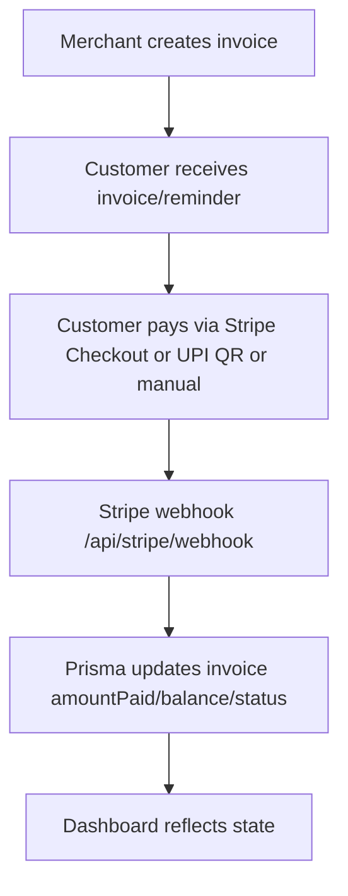

# Current Architecture — InvoNotify (InvoiceFlow)

> **Historical, pre-implementation snapshot.** This Phase 0 analysis describes
> the project before the Razorpay/AI recovery work. Use [`PRD.md`](../PRD.md),
> [`README.md`](../README.md), and
> [`docs/RAZORPAY_HACKATHON_TODO.md`](RAZORPAY_HACKATHON_TODO.md) as the current
> source of truth.

## 1. What this project is today

A **full-stack B2B invoice management system** ("InvoiceFlow" / InvoNotify):

- Create/read/update/delete invoices with line items, GST tax breakdown, templates.
- Customers, products, company settings.
- Automated multi-channel reminders (email, SMS, voice, Telegram) driven by cron.
- Dashboard analytics: KPIs, revenue trend, status distribution, high-risk customers.
- Stripe Checkout payment collection (webhook-driven).
- UPI payment QR embedded in invoice PDFs and reminder emails.
- Bulk import (YAML/Tally-oriented) and OCR.

It is a **notification + record-keeping system today**. It does NOT yet decide
what to do to recover money, predict payment risk with ML, or execute recovery
actions through an agentic workflow. That is the Razorpay Buildathon target.

## 2. High-level architecture

```mermaid
flowchart LR
  U[Browser] --> FE[Next.js App Router pages]
  FE --> API[Route Handlers app/api/**/route.ts]
  API --> AUTH[NextAuth lib/auth.ts]
  API --> PRISMA[Prisma Client lib/db.ts]
  PRISMA --> DB[(PostgreSQL)]
  API --> GMAIL[Gmail API lib/gmail.ts]
  API --> TG[Telegram lib/telegram.ts]
  API --> SMS[SMS lib/sms.ts - disabled]
  API --> STRIPE[Stripe Checkout + Webhook]
  API --> QR[UPI Payment QR]
  CRON[Vercel Cron / Task Scheduler] --> AUTO[/api/reminders/auto]
  SCRIPT[scripts/automation/run-reminders.js] --> AUTO
```

## 3. Key architectural characteristics

| Aspect | Current state |
|---|---|
| **Runtime model** | Next.js 16 App Router. Backend = Route Handlers. No separate API service. |
| **Rendering** | Dashboard pages are client components that `fetch()` their own data. `app/invoice/[id]` is a client page. |
| **Data layer** | Prisma 5.22 + PostgreSQL. Prisma Accelerate extension installed. |
| **Auth** | NextAuth v5 (Auth.js), Prisma adapter, JWT sessions, Google OAuth + Credentials (bcrypt). |
| **Tenancy** | Soft multi-tenant by `User`. Invoices scoped via `ownerUserId` OR `userId` (dual column legacy). Customers/products scoped via `ownerUserId`. |
| **Background work** | Cron endpoint `/api/reminders/auto` (secret-authorized). No queue/broker. Sequential sweep loop. |
| **Idempotency** | `InvoiceReminderLog` unique `(invoiceId, reminderKey)`. Stripe webhook dedup via manual `transactionId` existence check (no DB unique, no event-ID table). |
| **Webhook security** | Stripe HMAC signature verification implemented (custom, not Stripe SDK). |
| **Payments** | Stripe Checkout Sessions (redirect). Manual payment recording. No Razorpay. |
| **Risk scoring** | Rule-based CIBIL-like score in `lib/customer-credit.ts` (not ML). |
| **Notifications** | Email via Gmail API w/ PDF attachment; Telegram mirror; SMS fail-closed (disabled); Sarvam voice/TTS via scripts. |
| **Hosting** | Vercel (README describes a `vercel.json` cron, but no `vercel.json` exists in the repo — cron is only invoked via the local `scripts/automation` launcher today). `proxy.ts` (Next 16 middleware replacement) sets security headers only. |

## 4. Money lifecycle today (as built)



Missing vs. the Buildathon vision: payment-failure handling, overdue risk
prediction, automated recovery strategies, policy-gated actions, audit trail,
recovery learning loop, Razorpay Payment Links.

## 5. Notable observations / risks for the Buildathon work

1. **No Razorpay anywhere.** Stripe is the only PSP. Razorpay integration is
   greenfield — no conflicts with existing code.
2. **`next.config.ts` redirect breaks the public invoice page**:
   `/invoice/:path*` → `/dashboard/invoices`. Yet `app/invoice/[id]/page.tsx`
   exists and Stripe `success_url`/`cancel_url` point at `/invoice/{id}`.
   Customers are redirected to an authenticated dashboard after payment.
   The Razorpay Payment Link flow must use a customer-facing page/URL that is
   NOT under `/invoice/*`, or this redirect must be changed.
3. **No event-ID dedup table.** Stripe webhook dedups on `transactionId` only,
   after DB lookups. The Razorpay webhook should persist every event with a
   `UNIQUE(eventId)` as the Buildathon spec recommends (at-least-once delivery).
4. **No queue/broker.** The reminder cron loops synchronously. For the recovery
   orchestrator, an in-process queue or lightweight job table will be needed.
5. **`proxy.ts` only sets security headers** — it does NOT protect dashboard
   routes (there is no `middleware.ts`; Next 16 uses `proxy.ts`). API routes each
   call `auth()`. New recovery/agent API routes must do the same.
6. **No unit-test framework.** Only Playwright e2e is configured. ML evaluation
   needs a Python or TS test harness added.
7. **Dual ownership columns** (`ownerUserId` + `userId`) on Invoice complicate
   queries. New code should standardize on `ownerUserId`.
8. **Legacy schema-mismatch fallbacks** are baked into invoice routes (catch +
   retry without reminder fields). New tables should not copy this pattern.
9. **SMS is fail-closed/disabled.** Recovery actions must treat SMS as an
   unavailable channel and fall back to email/payment-link.
10. `.env` has `LLAMAINDEX_API_KEY` (currently unused) — indicates prior LLM
    experimentation; not wired into the app.
11. CIBIL score (rule-based) already exists on `Customer` — useful as a
    feature/input to the future ML risk model, and as a "risk" signal for the
    policy engine.

## 6. What is safe to build on vs. what must change

| Concern | Guidance |
|---|---|
| Reuse | `lib/db.ts`, `lib/auth.ts`, `lib/mail-service.ts`, `lib/gmail.ts`, `lib/customer-credit.ts`, `lib/reminders.ts`, `lib/stripe.ts` (as a template for a `lib/razorpay.ts`). |
| Extend schema | Add new models (WebhookEvent, AgentRun, AgentAction, RecoveryAttempt, PaymentEvent). Do NOT rework existing models unnecessarily. |
| New domains | `src/integrations/razorpay/`, `ai/`, `policy/`, `actions/`, `events/` (or keep under `lib/` + `app/api/` to match repo conventions). |
| Replace | Stripe is not being replaced; Razorpay is additive. SMS provider is disabled. |
