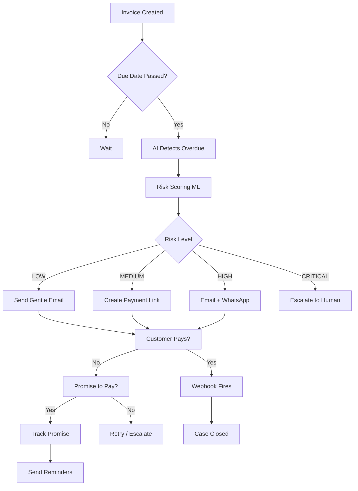
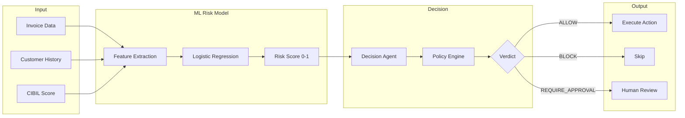
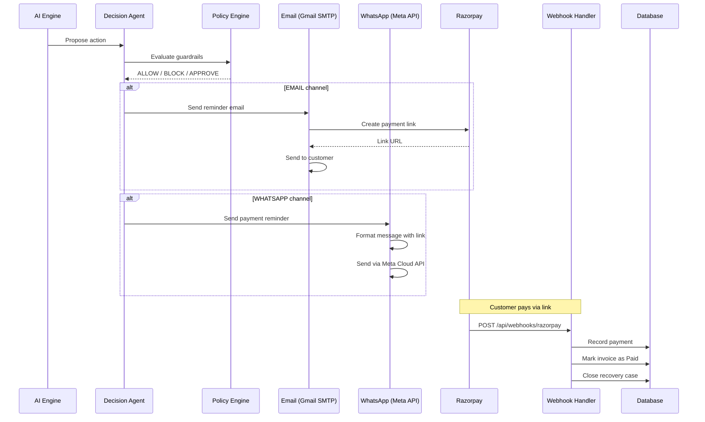
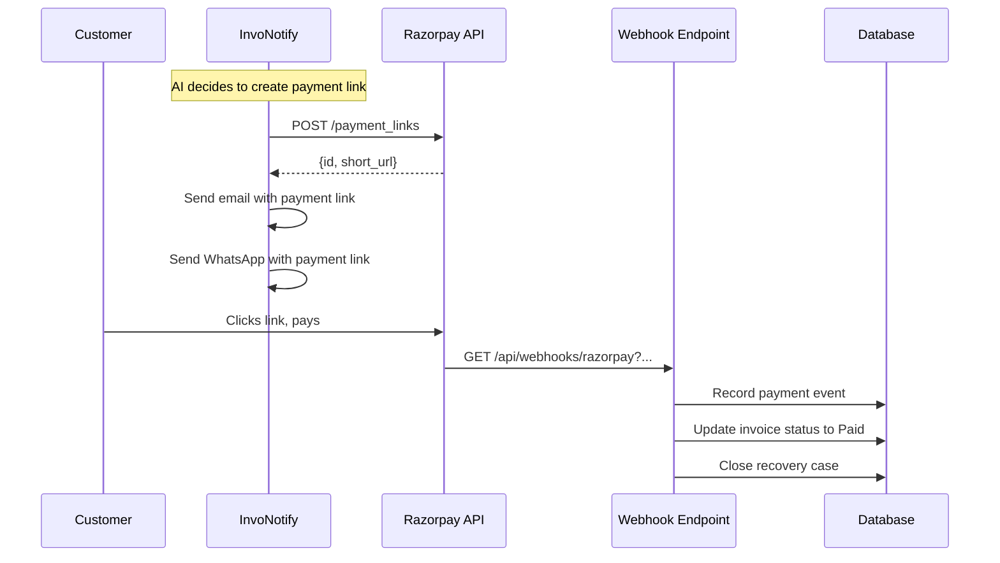

# InvoNotify — Architecture & System Design

## System Overview

InvoNotify is an AI-powered invoice revenue recovery platform that automatically detects overdue invoices, assesses risk, and executes multi-channel recovery actions using Razorpay payment links.

```
┌─────────────────────────────────────────────────────────────────────────────┐
│                           InvoNotify Architecture                          │
├─────────────────────────────────────────────────────────────────────────────┤
│                                                                             │
│  ┌──────────────┐    ┌──────────────┐    ┌──────────────┐                  │
│  │   Dashboard   │    │  AI Engine   │    │  Providers   │                  │
│  │   (Next.js)   │───▶│  (ML + LLM)  │───▶│  (Razorpay)  │                  │
│  └──────────────┘    └──────────────┘    └──────────────┘                  │
│         │                    │                    │                          │
│         ▼                    ▼                    ▼                          │
│  ┌──────────────┐    ┌──────────────┐    ┌──────────────┐                  │
│  │   Database    │    │  Policy      │    │  Channels    │                  │
│  │  (PostgreSQL) │    │  Engine      │    │  (Email/WA)  │                  │
│  └──────────────┘    └──────────────┘    └──────────────┘                  │
│                                                                             │
└─────────────────────────────────────────────────────────────────────────────┘
```

---

## Core Flow: Invoice → Recovery



---

## AI Decision Pipeline



---

## Multi-Channel Notification Flow



---

## ML Risk Scoring Model

### Features (11 inputs)

| Feature | Weight | Description |
|---------|--------|-------------|
| `amountDue` | 0.15 | Invoice balance amount |
| `daysOverdue` | 0.20 | Days past due date |
| `customerAgeDays` | 0.05 | How long customer has been with merchant |
| `previousInvoiceCount` | 0.08 | Total historical invoices |
| `previousLatePayments` | 0.18 | Count of late payments |
| `averagePaymentDelayDays` | 0.12 | Avg days late across history |
| `paymentSuccessRate` | 0.10 | % of invoices paid on time |
| `previousReminders` | 0.05 | Reminders already sent |
| `isVipExempt` | 0.02 | VIP exemption flag |
| `cibilScore` | 0.03 | Credit bureau score |
| `humanEngaged` | 0.02 | Human agent involved |

### Risk Levels

```
Score ≥ 0.85  →  CRITICAL  (escalate immediately)
Score ≥ 0.70  →  HIGH      (aggressive follow-up)
Score ≥ 0.40  →  MEDIUM    (payment link + reminders)
Score < 0.40  →  LOW       (gentle nudge)
```

---

## Policy Engine Guardrails

The policy engine evaluates 9 guardrails before every action:

| # | Guardrail | Description |
|---|-----------|-------------|
| 1 | **Invoice Status** | Block if already paid |
| 2 | **Opt-Out Check** | Block if customer opted out |
| 3 | **Dispute Check** | Block if invoice disputed |
| 4 | **VIP Handling** | Route to human for VIPs |
| 5 | **Cost Floor** | Stop if balance too low to recover |
| 6 | **Auto Money Limit** | Require approval for large amounts |
| 7 | **Contact Frequency** | Enforce cooldown between contacts |
| 8 | **Daily Cap** | Limit escalations per day |
| 9 | **Business Hours** | Only send during allowed hours |

---

## Database Schema (Key Tables)

```
┌─────────────────┐     ┌─────────────────┐
│      User        │     │     Invoice      │
├─────────────────┤     ├─────────────────┤
│ id              │────▶│ id              │
│ email           │     │ ownerUserId     │
│ name            │     │ invoiceNumber   │
│ password        │     │ clientName      │
└─────────────────┘     │ clientEmail     │
                        │ balance         │
                        │ status          │
                        │ dueDate         │
                        │ razorpayPayment │
                        │   LinkId        │
                        └─────────────────┘
                                │
                                ▼
┌─────────────────┐     ┌─────────────────┐
│  RecoveryCase    │     │   AgentAction    │
├─────────────────┤     ├─────────────────┤
│ id              │────▶│ id              │
│ invoiceId       │     │ caseId          │
│ status          │     │ actionType      │
│ stage           │     │ channel         │
│ riskScore       │     │ status          │
│ expectedRecovery│     │ policyDecision  │
└─────────────────┘     └─────────────────┘
        │
        ▼
┌─────────────────┐     ┌─────────────────┐
│   PromiseToPay   │     │  PaymentEvent    │
├─────────────────┤     ├─────────────────┤
│ id              │     │ id              │
│ caseId          │     │ invoiceId       │
│ status          │     │ source          │
│ promisedDate    │     │ eventType       │
│ source          │     │ razorpayEventId │
└─────────────────┘     └─────────────────┘
```

---

## Razorpay Integration Flow



---

## Dashboard Pages

| Route | Description |
|-------|-------------|
| `/dashboard` | Main dashboard with KPIs |
| `/dashboard/invoices` | Invoice list + create |
| `/dashboard/invoices/create` | Create/edit invoice form |
| `/dashboard/customers` | Customer management |
| `/dashboard/recovery` | AI recovery war room |
| `/dashboard/recovery/analytics` | Strategy analytics + funnel |
| `/dashboard/diagnosis` | ML failure diagnosis |
| `/dashboard/credit-scores` | CIBIL score dashboard |
| `/dashboard/promises` | Promise-to-pay tracking |
| `/dashboard/whatsapp` | WhatsApp channel config |
| `/dashboard/settings` | Merchant settings |

---

## API Endpoints

### Core
- `POST /api/invoices` — Create invoice
- `GET /api/invoices` — List invoices
- `POST /api/payments` — Record payment

### AI Recovery
- `GET /api/ai/recovery` — List recovery cases
- `POST /api/ai/recovery` — Run AI sweep
- `POST /api/ai/recovery/[id]/approve` — Approve action

### v1 API
- `POST /api/v1/recovery-cases/[id]/diagnose` — ML diagnosis
- `POST /api/v1/recovery-cases/[id]/score` — Risk scoring
- `POST /api/v1/recovery-cases/[id]/promises` — Create promise
- `POST /api/v1/promises/reminders` — Process reminders
- `POST /api/v1/credit-score` — Fetch credit scores

### Webhooks
- `GET/POST /api/webhooks/razorpay` — Razorpay payment events

---

## Tech Stack

| Layer | Technology |
|-------|------------|
| Frontend | Next.js 16, React 19, Tailwind CSS |
| Backend | Next.js API Routes |
| Database | PostgreSQL (Neon) + Prisma ORM |
| Auth | NextAuth v5 |
| Payments | Razorpay Test Mode |
| Email | Gmail SMTP (nodemailer) |
| WhatsApp | Meta Cloud API |
| ML | Logistic Regression (custom) |
| LLM | GPT-4o-mini (decision agent) |
| Hosting | Vercel |
| CI/CD | GitHub Actions |

---

## Deployment

```
GitHub ──push──▶ Vercel ──deploy──▶ Production
                    │
                    ├──▶ /api/ai/recovery (cron every 6h)
                    ├──▶ /api/reminders/auto (cron daily)
                    └──▶ /api/webhooks/razorpay (webhook)
```

---

## Security

- Session-based auth via NextAuth
- User-scoped database queries
- Cron endpoints require `CRON_SECRET`
- Razorpay webhook signature verification
- Policy engine blocks unauthorized actions
- Audit trail for every decision
